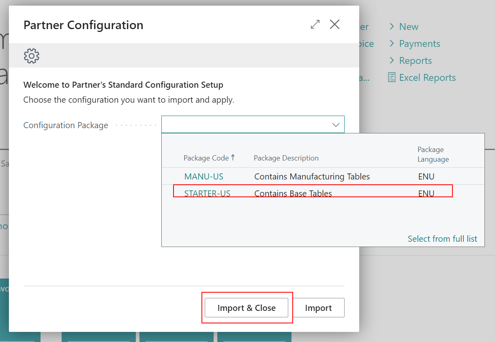

# Partner Configuration
## General Information
This project contains the wizard allowing to download configuration packages from the partner repository

To use the project you need to do the following (more details in the next sections):

1. Create Azure Storage Container and upload the Rapid Start configuration packages to it.
2. Create a configuration json file in the root of the container 
3. Insert setup of the `Partner Configuration Setup` page.
4. Run `Partner Configuration Wizard` and choose the package to apply.

## Create Azure Storage Container
To create Azure Storage Container you need to do the following:
1. Go to the [Azure Portal](https://portal.azure.com/) and login.
2. Click on the `Storage accounts` and then click on the `Add` button.
3. Fill in the required fields and click on the `Review + create` button.
4. Click on the `Create` button.
5. Click on the created storage account and then click on the `Containers` button.
6. Create a new container with the custom name (for example `confpacks`)


## Upload Rapid Start configuration packages

To upload Rapid Start configuration packages you need to do the following:

1. Export Rapid start configuration packages from the Business Central.
2. Upload Rapid Start configuration packages to the created container.


## Create configuration json file

To create configuration json file you need to do the following:
1. Create a new json file with custom name
2. Add content to the file in schema as below
```json
{
"config":[
    {
       "Code": "Starter-US",
       "Name": "STARTER-US",
       "Description": "Contains Base Tables",
       "Language": "ENU"
    },
    {
        "Code": "Manu-US",
        "Name": "MANU-US",
        "Description": "Contains Manufacturing Tables",
        "Language": "ENU"
     }
    ]
}
```
3. Upload the file to the created container
   
**Notes:**
1. For each configuration package you need to create a new object in the `config` array.
2. Name property should be the same as name of the configuration package file create in previous point without .rapidstart extension.
3. Code should be unique for each configuration package.
4. Description and Language are used only for information.

## Insert setup of the Partner Configuration Setup page

1. Open in Business Central page `Partner Configuration Setup`
2. Set Azure Account Name, Azure Account Key and Azure Container Name fields. You can find those information in the Azure Portal.


3. You can manually set Setup List File with a json file created in previous point or you can use the `Get Setup List File` action to download the file from the Azure Storage Container.


## Run Partner Configuration Wizard

To run Partner Configuration Wizard you need to do the following:

1. Find the `Partner Configuration`.
2. Choose the configuration package to apply and click on the `Import` or `Import & Close` button.



After action the configuration package will be applied to the Business Central.

# Contributing

All contributions are welcome.

Ths project is open for contributions. If you have any ideas, just open an issue and describe your idea or create a pull request.

## Ideas for contributions:
1. Create a configuration file directly in the Business Central and upload it to the Azure Storage Container.
2. Upload Rapid Start configuration packages to the Azure Storage Container directly from the Business Central.